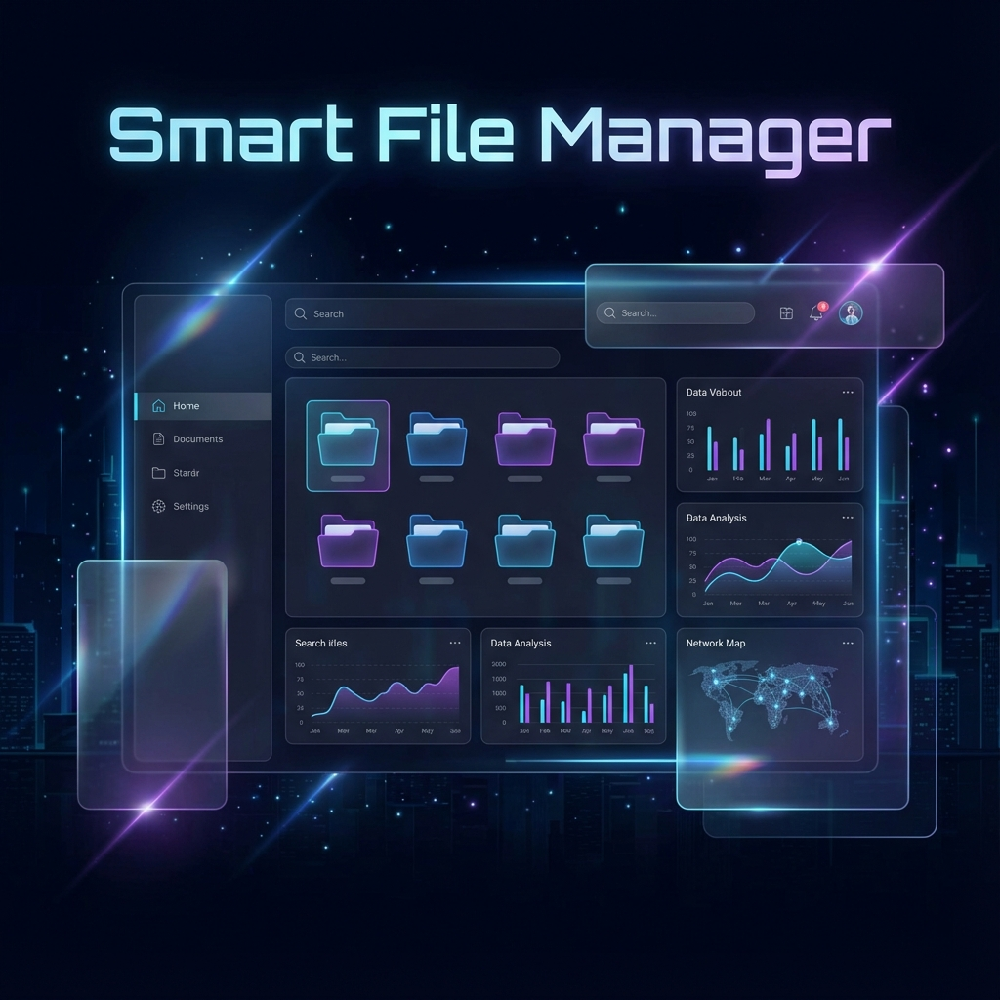

# Smart File Manager (D365)
 

**Smart File Manager**, yerel dosya sisteminizi tarayan, web tabanlı modern bir arayüz üzerinden dosyalarınızı hızlıca bulmanızı, etiketlemenizi ve yönetmenizi sağlayan profesyonel bir araçtır.

## 🚀 Özellikler

*   **🔍 Hızlı Dosya Tarama:** Belirlenen dizinleri derinlemesine tarayarak veritabanına indeksler (SQLite).
*   **📂 Gelişmiş Arama & Filtreleme:** Dosyaları isme, türe, uzantıya veya etikete göre anında bulun.
*   **🏷️ Metadata & Etiketleme:** Dosyalarınıza özel etiketler (tags) ve önem derecesi (importance: High, Medium, Low) atayın.
*   **🖥️ Sistem Entegrasyonu:** Dosyaları doğrudan tarayıcı üzerinden, işletim sistemindeki varsayılan uygulamasıyla tek tıkla açın.
*   **🎨 Modern Arayüz:** React, Vite ve TailwindCSS ile geliştirilmiş, gece moduna uyumlu, "Glassmorphism" esintili şık tasarım.
*   **⚡ Performanslı Veritabanı:** 100.000+ dosyayı saniyeler içinde sorgulayabilen optimize edilmiş SQLite yapısı.

## 🛠️ Kurulum ve Çalıştırma

Projeyi yerel makinenizde çalıştırmak için aşağıdaki adımları izleyin.

### Ön Gereksinimler (Prerequisites)
*   [Node.js](https://nodejs.org/) (v16 veya üzeri önerilir)
*   Git

### 1. Projeyi Klonlayın
```bash
git clone https://github.com/ufukkay/D365.git
cd D365
```

### 2. Sunucuyu (Server) Hazırlayın ve Başlatın
Arka uç (Backend), API servislerini ve veritabanı bağlantısını yönetir.

```bash
cd server
npm install    # Bağımlılıkları yükle
node server.js # Sunucuy başlata (Port: 3001)
```
*Sunucu çalıştığında: `http://localhost:3001` adresinde aktif olacaktır.*
💡 **İpucu:** Geliştirme modunda otomatik yeniden başlatma için `npm run dev` (nodemon varsa) kullanabilirsiniz.

### 3. İstemciyi (Client) Hazırlayın ve Başlatın
Yeni bir terminal açın ve ön yüz (Frontend) uygulamasını başlatın.

```bash
cd client
npm install    # Bağımlılıkları yükle
npm run dev    # Geliştirme sunucusunu başlat
```
*Uygulama genellikle `http://localhost:5173` adresinde açılacaktır.*

---

## 🌐 IIS (Internet Information Services) Üzerinde Yayınlama

Bu uygulamayı Windows Server veya Windows 10/11 üzerinde IIS ile yayınlamak için aşağıdaki adımları izleyin.

### Adım 1: IIS ve URL Rewrite Modülü Kurulumu
1.  **IIS'i Etkinleştirin:** Windows Özelliklerini Aç/Kapat > Internet Information Services.
2.  **Application Request Routing (ARR) Kurun:** IIS üzerinden Node.js process'ine proxy yapmak için gereklidir.
3.  **URL Rewrite Modülünü İndirin ve Kurun:** [IIS URL Rewrite](https://www.iis.net/downloads/microsoft/url-rewrite).
4.  **Node.js'i Sunucuya Kurun:** Sunucuda Node.js yüklü olmalıdır.

### Adım 2: Frontend (React) Build Alınması
React uygulamasını statik dosyalara dönüştürün.
```bash
cd client
npm run build
```
Bu işlem `client/dist` klasöründe yayınlanmaya hazır dosyaları oluşturur.

### Adım 3: Backend (Server) Yapılandırması
1.  Sunucuda (örn: `C:\inetpub\wwwroot\smart-file-manager`) bir klasör oluşturun.
2.  `server` klasöründeki dosyaları buraya kopyalayın.
3.  `client/dist` içindeki dosyaları, sunucu klasöründe `public` adında bir klasör açıp içine atın.
4.  `server.js` dosyasında şu satırı ekleyerek statik dosyaların sunulmasını sağlayın:
    ```javascript
    const path = require('path');
    app.use(express.static(path.join(__dirname, 'public')));
    app.get('*', (req, res) => {
        res.sendFile(path.join(__dirname, 'public', 'index.html'));
    });
    ```
5.  Prodüksiyon için `pm2` gibi bir process manager kullanmanız önerilir:
    ```bash
    npm install -g pm2
    pm2 start server.js --name "smart-file-manager"
    ```

### Adım 4: IIS Ters Proxy (Reverse Proxy) Ayarı
1.  IIS Yöneticisi'ni açın ve yeni bir **"Add Website"** oluşturun.
2.  Portu (örn: 80 veya 8080) belirleyin.
3.  Website ana dizininde bir `web.config` dosyası oluşturun ve şu kuralları ekleyin (Node.js'e yönlendirme için):

```xml
<configuration>
  <system.webServer>
    <rewrite>
      <rules>
        <rule name="NodeJS Proxy" stopProcessing="true">
          <match url="(.*)" />
          <action type="Rewrite" url="http://localhost:3001/{R:1}" />
        </rule>
      </rules>
    </rewrite>
  </system.webServer>
</configuration>
```
*Not: Bu basit bir Reverse Proxy ayarıdır. Node.js sunucusu 3001 portunda arkada çalışmaya devam etmelidir.*

---

## 🗺️ Geliştirme Planı (Roadmap)

Gelecek sürümler için planlanan özellikler:

- [ ] **v1.1 - Önizleme Modu:** PDF ve Resim dosyalarının uygulama içinde önizlenmesi.
- [ ] **v1.2 - Toplu İşlemler:** Birden fazla dosyayı aynı anda silme/taşıma.
- [ ] **v1.3 - Cloud Sync:** Etiketlerin ve veritabanının buluta yedeklenmesi.
- [ ] **v2.0 - Kullanıcı Yetkilendirme:** Login ekranı ve çoklu kullanıcı desteği.

## 🏗️ Proje Yapısı

*   `/server`: Express.js API, SQLite Veritabanı, Dosya Servisleri.
*   `/client`: React, TailwindCSS, Axios, Lucide React (İkonlar).
*   `files.db`: Uygulamanın kalbi (Veritabanı).

## 📝 Lisans
MIT License - Özgürce kullanabilir ve geliştirebilirsiniz.
